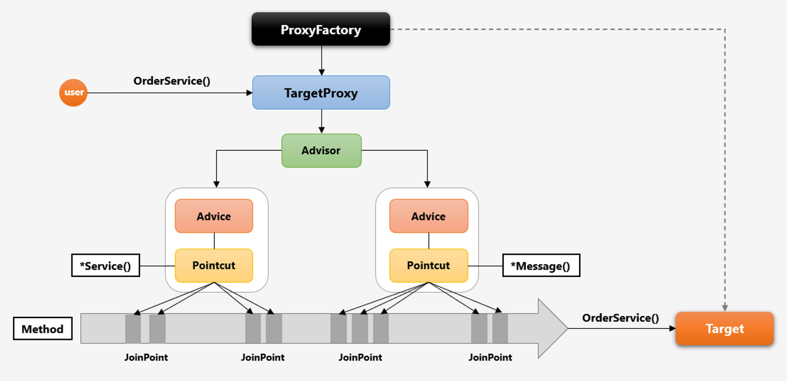

# AOP

- ASPECT ORIENTED PROGRAMMING
- 횡단 관심사를 분리하여 모듈화하는 프로그래밍 기법
- 핵심적인 관점, 부가적인 관점을 나누어 관점 기준으로 모듈화하는 프로그래밍 기법
  - 핵심 관점 : 핵심 비즈니스 로직
  - 부가적 관점 : 로깅, 트랜잭션, 보안, DB연결 등

- 주요 개념
  - Aspect: 횡단 관심사
    - 여러 객체에 공통으로 적용되는 기능
  - Advice: Aspect의 행위
    - Aspect에서 실질적인 기능 자체
    - Before, After, Around , After-returning, After-throwing
  - Pointcut: Join point의 부분 집합
    - Join Point의 상세 스펙을 정의한 것
  - Target: Aspect를 적용할 대상
    - Aspect를 적용할 클래스, 메소드 등
  - Join point: Advice가 적용될 위치 
    - Advice가 Target에 적용되는 시점
    - 메소드 호출, 필드 접근, 객체 생성 등
  - Weaving: Advice를 핵심 로직에 적용하는 행위
    - 컴파일 시점, 클래스 로딩 시점, 실행 시점 등 적용

- Aspect
```java
import org.aspectj.lang.annotation.Aspect;
import org.aspectj.lang.annotation.Before;

@Aspect // Aspect 클래스임을 명시
public class LoggingAspect {
    
    @Before("execution(* com.example.service.*.*(..))") // Pointcut 설정, com.example.service 패키지의 모든 메서드 호출 전에 logBeforeMethod가 실행된다.
    public void logBeforeMethod() { // Advice , Aspect의 행위 정의
        System.out.println("Method execution started");
    }
}
```

- Service
```java
package com.example.service;

public class MyService { 
    public void performTask() { // Target, Aspect를 적용할 대상
        System.out.println("Performing task");
    }
}
```

```java
package com.example;

import com.example.service.MyService;
import org.springframework.context.ApplicationContext;
import org.springframework.context.support.ClassPathXmlApplicationContext;

public class Main {
    public static void main(String[] args) {
        ApplicationContext context = new ClassPathXmlApplicationContext("applicationContext.xml");
        MyService myService = context.getBean(MyService.class);
        myService.performTask(); // Join Point, Target의 performTask 메서드 호출 시점
    }
}
```

- 이 설정을 통해 com.example.service 패키지의 모든 메서드가 호출되기 전에 logBeforeMethod가 실행된다.

## 각 AOP 매핑
- 애스펙트(Aspect): LoggingAspect 클래스
- 어드바이스(Advice): logBeforeMethod 메서드
- 포인트컷(Pointcut): "execution(* com.example.service.*.*(..))" 표현식
- 타겟(Target): MyService 클래스의 performTask 메서드
- 조인포인트(Join Point): performTask 메서드 호출 시점
- 위빙(Weaving): aop:aspectj-autoproxy 설정에 의해 런타임 시에 이루어짐

## 프록시 기반
- AOP는 프록시를 이용하여 구현된다.
- 프록시 기반 AOP

### 프록시 패턴
  - 프록시 패턴은 객체를 직접 접근하는 대신 그 객체의 대리자(proxy)를 통해 접근하는 디자인 패턴
  - 프록시는 실제 객체와 동일한 인터페이스를 구현하며, 메서드 호출을 가로채 추가적인 작업을 수행할 수 있다.


